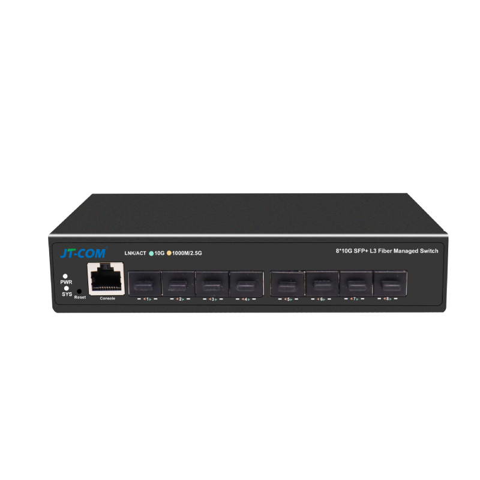
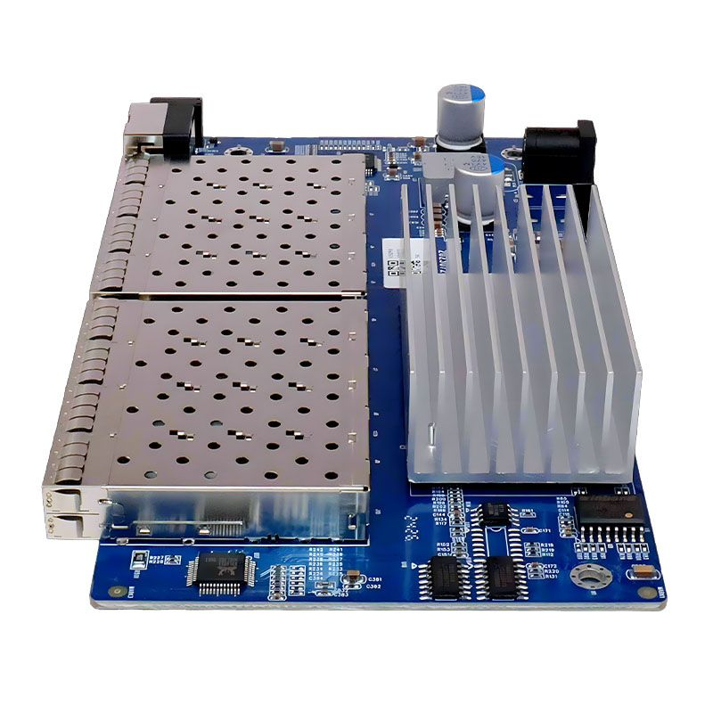
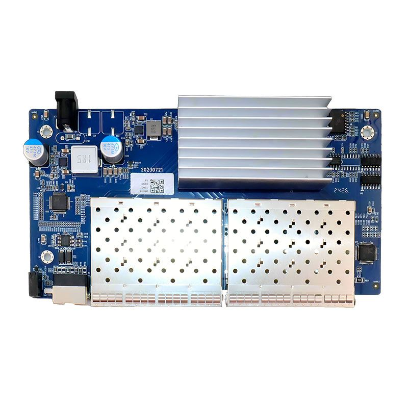

# JT-S508CL-8S OpenWrt Auto-Build Project

[English](#jt-s508cl-8s-openwrt-auto-build-project) | [简体中文](#jt-s508cl-8s-openwrt-自动编译项目)

This project is designed to automatically compile OpenWrt firmware for the **JT-S508CL-8S** L3 managed fiber switch/router (based on the Realtek RTL930x solution). The core compilation scripts and workflow framework are Forked/Modified from [VIKINGYFY](https://github.com/VIKINGYFY), leveraging GitHub Actions for cloud-based automated compilation. The source code is based on the highly customized [ImmortalWrt](https://github.com/immortalwrt/immortalwrt).

---

## 📷 Product Showcase / 产品展示

We showcase the JT-S508CL-8S switch here:

| Front View / 正面外观 | Board Side View / 主板侧视 | Board Top-down View / 主板俯视 |
|:---:|:---:|:---:|
|  |  |  |

---

## 🛒 Where to Buy / 购买渠道

You can purchase the JT-S508CL-8S switch through the following links:
- **AliExpress (International)**: [Buy on AliExpress](https://www.aliexpress.com/item/1005008497821015.html)
- **Tmall / Taobao (China)**: [Buy on Tmall (天猫购买链接)](https://detail.tmall.com/item.htm?id=758911123734&skuId=5230615100877)

---

## 🌟 Introduction

This repository contains a complete CI workflow that pulls the ImmortalWrt source code automatically (via scheduled tasks or manual triggers) and outputs high-performance firmware tailored for the specific hardware.

### 💻 Supported Hardware Platforms
- **Target Platform**: Realtek (`rtl930x`)
- **Adapted Devices**: JT-FG6700-8TFM / ONT-S508CL-8S

## ⚙️ Default Firmware Settings

- **Default IP Address**: `192.168.10.1`
- **Default Username**: `root`
- **Default Password**: None (Empty)
- **Default Theme**: `luci-theme-argon`

## 💽 Flashing Guide

For detailed flashing steps (including Shell access, power supply description, and firmware writing, etc.), please refer to the Xikestor SKS8300-8x page in the OpenWrt Official Hardware Wiki (JT-S508CL-8S shares the same scheme):

👉 **[Click to View: OpenWrt Wiki - Xikestor SKS8300-8x Flashing and Hardware Instructions](https://openwrt.org/toh/xikestor/sks8300-8x?s[]=shell&s[]=supply)**

## 🚀 Compilation Guide (How to Use)

1. **Fork this repository** to your personal GitHub account.
2. Go to the **Actions** page of your forked repository, and click `I understand my workflows, go ahead and enable them` to enable the workflows.
3. Select the `QCA-ALL` task in the left menu.
4. Click `Run workflow` on the right side of the page to start compiling in the cloud.
5. Once the compilation is complete, go to the task details page and download the packed firmware under **Artifacts**, or retrieve it directly from the project's **Releases** page.

## 📄 License & Acknowledgements

- **Acknowledgements**: The automated build scripts, plugin integration logic, and workflow framework of this project originate from [VIKINGYFY](https://github.com/VIKINGYFY)'s open-source sharing. Special thanks to them!
- **License**: This project is licensed under the [MIT License](LICENSE).

Copyright (c) 2026 Hu Jun.

---

# JT-S508CL-8S OpenWrt 自动编译项目

[English](#jt-s508cl-8s-openwrt-auto-build-project) | [简体中文](#jt-s508cl-8s-openwrt-自动编译项目)

本项目用于自动化编译适用于 **JT-S508CL-8S** (基于 Realtek RTL930x方案) 交换机/路由器的 OpenWrt 固件。项目核心编译脚本与工作流框架 Fork/修改自 [VIKINGYFY](https://github.com/VIKINGYFY)，基于 GitHub Actions 实现云端自动编译，源码采用高度定制的 [ImmortalWrt](https://github.com/immortalwrt/immortalwrt)。

## 🌟 项目简介

本项目包含一套完整的 CI 工作流，通过定时任务和手动触发，自动拉取 ImmortalWrt 源码，最终输出适配特定硬件的高性能固件。

### 💻 支持的硬件平台
- **目标平台**: Realtek (`rtl930x`)
- **适配设备**: JT-FG6700-8TFM / ONT-S508CL-8S

## ⚙️ 固件默认配置

- **默认 IP**: `192.168.10.1`
- **默认用户名**: `root`
- **默认密码**: 无 (空)
- **默认主题**: `luci-theme-argon`

## 💽 烧录教程 (刷机指南)

关于设备的详细烧录与刷机步骤（包含 Shell 访问、供电说明及固件刷写等），请参考 OpenWrt 官方硬件维基中的 Xikestor SKS8300-8x 页面（JT-S508CL-8S 与该方案通用）：

👉 **[点击查看：OpenWrt Wiki - Xikestor SKS8300-8x 烧录与硬件说明](https://openwrt.org/toh/xikestor/sks8300-8x?s[]=shell&s[]=supply)**

## 🚀 编译指南 (如何使用)

1. **Fork 本仓库** 到你的个人 GitHub 账号下。
2. 进入仓库的 **Actions** 页面，点击 `I understand my workflows, go ahead and enable them` 以启用工作流。
3. 在左侧菜单中选择 `QCA-ALL` 任务。
4. 点击页面右侧的 `Run workflow` 开始云端编译。
5. 编译结束后，进入该次任务的详情页，在 **Artifacts** 中下载打包好的固件，或直接在项目的 **Releases** 页面获取。

## 📄 许可证与鸣谢

- **技术鸣谢**: 本项目的自动化编译脚本、常见插件集成逻辑及工作流框架源自 [VIKINGYFY](https://github.com/VIKINGYFY) 的开源分享，特此鸣谢。
- **许可证**: 本项目采用 [MIT License](LICENSE) 许可协议。

Copyright (c) 2026 Hu Jun.
